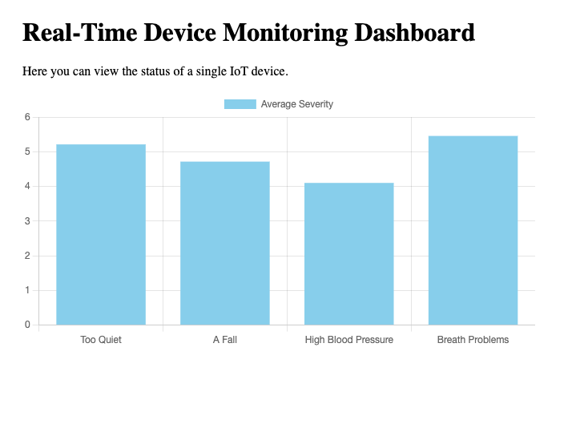

## Getting Started

First, run the socket:
```bash
cd pages/api
node websocket.js
```

Second, run the development server:

```bash
npm i
npm run dev
```

Open [http://localhost:3000](http://localhost:3000) with your browser

* If the socket is showing connection logs, please refresh the page

* 